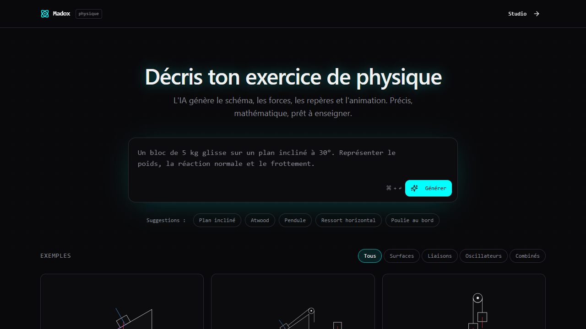

# Hand Canvas



## Overview
Hand Canvas is a web application built with Vite, React, TypeScript, shadcn/ui, and Tailwind CSS. It provides an interactive canvas-based interface for creative work.

## Features
- Interactive canvas workspace
- Responsive design for desktop and mobile
- Modern UI with Tailwind CSS and shadcn/ui components
- Real-time interactions

## Technology Stack
- **Vite** - Build tool and dev server
- **TypeScript** - Type safety
- **React** - UI library
- **shadcn/ui** - Component library
- **Tailwind CSS** - Styling

## Getting Started

### Prerequisites
- Node.js 18+
- npm or yarn

### Installation
```bash
git clone <repository-url>
cd hand-canvas
npm install
```

### Development
```bash
npm run dev
```

Open [http://localhost:5173](http://localhost:5173) to view the app.

### Build
```bash
npm run build
```

## Screenshots


## License
MIT